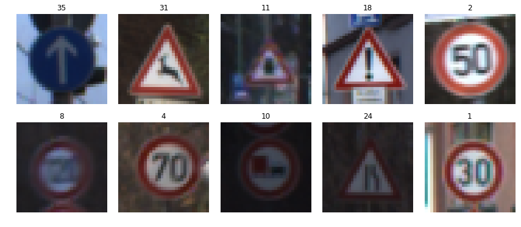
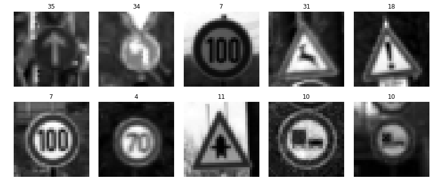
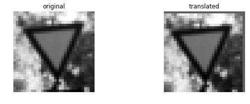
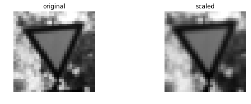
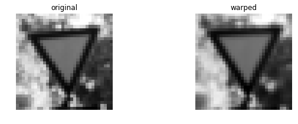
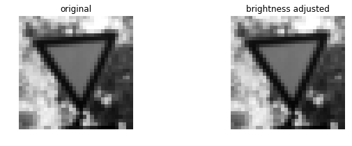
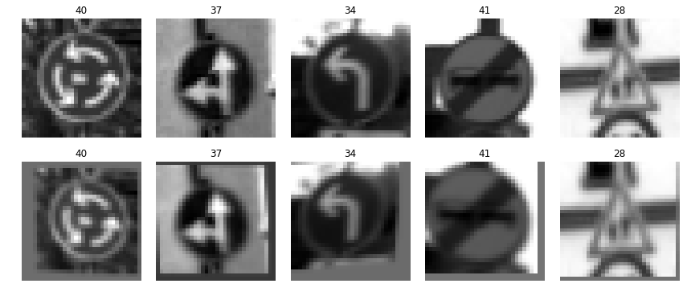
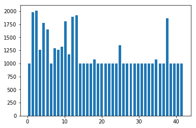
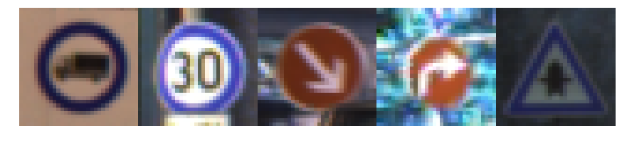

# [Rubric Points](https://review.udacity.com/#!/rubrics/481/view) 
# **1. Files Submitted**

*1) Submission Files: The project submission includes all required files.*

**Comment**: All required files are included in this repository.
* The Traffic_Sign_Classifier.ipynb notebook file with all questions answered and all code cells executed and displaying output.
* An HTML or PDF export of the project notebook with the name report.html or report.pdf.
* Any additional datasets or images used for the project that are not from the German Traffic Sign Dataset.
* A writeup report as a markdown or pdf file (this file)

# **2. Dataset Exploration**

*1) Dataset Summary: The submission includes a basic summary of the data set.*

**Comment**: The code for this step is contained in the 2nd cell of the IPython notebook. I used the numpy library to calculate summary statistics of the traffic signs data set:

* The size of training set is 34,799
* The size of validation set is 4,410
* The size of test set is 12,630
* The shape of a traffic sign image is (32, 32, 3)
* The number of unique classes/labels in the data set is 43

*2) Exploratory Visualization: The submission includes an exploratory visualization on the dataset.*

**Comment**: The code in the 3rd cell shows 10 random image data extracted from the training set (ref. 1):

The code in the 4th cell shows a histogram showing the frequency of each class:

The historgram clearly shows significant variability in class representation - some classes < 250 and other classes > 1,500. I addressed the over/under-representation issue by data augmentation (see *Preprocessing* below).

# **3. Design and Test a Model Architecture**

*1) Preprocessing: The submission describes the preprocessing techniques used and why these techniques were chosen.*

**Comment**: First, I converted the images to grayscale and normalized the signal intensity to (-1, 1) to improve the model preformance. The code is included in the 5th cell.

* The shape of the image after grayscaling/normalization is (32, 32, 1)
* The mean signal intensity of the image is:
  + Training set -0.354081335648
  + Validation set -0.347215411128
  + Test set -0.358215153428

Below are 10 random image data extracted from the training set after grayscaling and normalization

Second, I augmented the training set to address the over/under-representation issue. Specifically, I used a combination of random translation, random scaling, random warping, and random brightness to increase the minium number of each label to be 1,000.

The 6th cell contains the code for random translation:

The 7th cell contains the code for random scaling:

The 8th cell contains the code for random warping:

The 9th cell contains the code for random brightness:

Below is a comparison between the orignal (top row) and the augmented images (bottom row) of 5 randomly selected images (12th cell).

In the original training set, the minimum number of label was 180 (10th cell). In the augmented training set, I increased it to 1,000 (11th cell). Now the historgram shows more homogeneous distribution of labels (13th cell). 

In this project I did not use rotation or flips, because it is unlikely that the self-driving would encounter rotated (hopefully) or flipped traffic signs. I also did not use color perturbation because the images are grayscale.

*2) Model Architecture: The submission provides details of the characteristics and qualities of the architecture, such as the type of model used, the number of layers, the size of each layer. Visualizations emphasizing particular qualities of the architecture are encouraged.*

**Comment**: The code for my final model is located in the 16th cell. Initially I used the original LeNet model and simply changed the output to 43 labels instead of 10 numbers. However, after several iterations the test accuracy reached only at 0.834. So I used the modified LeNet model (ref. 2). My final model consists of the following layers:

| Layer         		|     Description	        					| 
|:---------------------:|:---------------------------------------------:| 
| Input         		| 32x32x1 grayscale image   							| 
| **Layer 1: Convolution 5x5**     	| 1x1 stride without padding. Output 28x28x6 	|
| RELU					|												|
| Max pooling	      	| 2x2 stride. Output 14x14x6 				|
| **Layer 2: Convolution 5x5**	    |  1x1 stride without padding. Output 10x10x16  	|
| RELU		|         									|
| Max pooling		| 2x2 stride. Output 5x5x16        									|
|	Flatten Layer 2		|	Output 400									|
|	**Layer 3: Convolution 5x5**	|	1x1 stride without padding. Output 1x1x400		|
| RELU		|         									|
|	Flatten Layer 3		|	Output 400							|
|	Concatenate Layer 2 and Layer 3		|	Output 800						|
|	Dropout		|	Output 800						|
|	**Layer 4: Fully connected**		|	Output 120						|
| RELU		|         									|
|	**Layer 5: Fully connected**		|	Output 84						|
| RELU		|         									|
|	**Layer 6: Fully connected**		|	Output 43						|

*3) Model Training: The submission describes how the model was trained by discussing what optimizer was used, batch size, number of epochs and values for hyperparameters.*

**Comment**: The code for training the model is located in the 18th cell of the ipython notebook. To train the model, I used the following parameters:

* Learning rate at 0.001
* Adam optimizer to minimize the loss of cross-entropy
* Batch size was initially set at 100-128 and had an accuracy >0.90. Since the size of the training set increased to >50,000 by augmentation, the batch size was increased to 500 to take full advantage of the training set. As a result, the model performance improved slightly.
* Number of epochs was set at 100, which was a realistic maximum on my MacBook Air (CPU only)

*4) Solution Approach: The submission describes the approach to finding a solution. Accuracy on the validation set is 0.93 or greater.*

**Comment**: The code for calculating the accuracy of the model is located in the 19th cell.

My final model results were:
* Validation set accuracy of 0.929 at EPOCH 100
* Test set accuracy of 0.931 > 0.93!

Summary of iterations:
* Initially I used the original LeNet model, but the test accuracy reached only at 0.834. So I used the modified LeNet model (ref. 2).
* The modified LeNet model produced higher test accuracy values than the original LeNet model, but the test accuracy was still < 0.92.
* I removed Layers 4, 5 and 6 (fully connected layers) but the test accuracy did not significantly improve.
* Other parameters that I iterated include learning rate, batch size, droput probability.
 
 
# **4. Test a Model on New Images**

*1) Acquiring New Images: The submission includes five new German Traffic signs found on the web, and the images are visualized. Discussion is made as to any particular qualities of the images or traffic signs in the images that may be of interest, such as whether they would be difficult for the model to classify.*

**Comment**: I downloaded the test set from [**Dataset discussion: German Traffic Signs**](http://forums.fast.ai/t/dataset-discussion-german-traffic-signs/766). I picked 5 random images shown below:

The same preprocessing (grayscaling and normalization) was applied to the 5 images. There are two potential issues associates with the new 5 images that may make the model perfomance low:

* Red and blue are inverted. For example, the edge of the 1st image ("Vehicles over 3.5 metric tons prohibited") should actually be red, but in this image it is blue. Therefore, the pixel values may be off from those of the training set. However, grayscaling should address at least some of the issue.
* The signal intensity seems higher than those of the traning set. Therefore, the pixel values may be off from those of the training set. However, normalization should address at least some of the issue.

*2) Performance on New Images: The submission documents the performance of the model when tested on the captured images. The performance on the new images is compared to the accuracy results of the test set.*

**Comment**:

ANALYZE NEW IMAGE PERFORMANCE IN MORE DETAIL
Calculating the accuracy on these five German traffic sign images found on the web might not give a comprehensive overview of how well the model is performing. Consider ways to do a more detailed analysis of model performance by looking at predictions in more detail. For example, calculate the precision and recall for each traffic sign type from the test set and then compare performance on these five new images..

If one of the new images is a stop sign but was predicted to be a bumpy road sign, then we might expect a low recall for stop signs. In other words, the model has trouble predicting on stop signs. If one of the new images is a 100 km/h sign but was predicted to be a stop sign, we might expect precision to be low for stop signs. In other words, if the model says something is a stop sign, we're not very sure that it really is a stop sign.

Looking at performance of individual sign types can help guide how to better augment the data set or how to fine tune the model. 

*3) Model Certainty - Softmax Probabilities: The top five softmax probabilities of the predictions on the captured images are outputted. The submission discusses how certain or uncertain the model is of its predictions.*

**Comment**:

CREATE VISUALIZATIONS OF THE SOFTMAX PROBABILITIES
For each of the five new images, create a graphic visualization of the soft-max probabilities. Bar charts might work well.

VISUALIZE LAYERS OF THE NEURAL NETWORK
See Step 4 of the Iptyon notebook for details about how to do this.

###Test a Model on New Images

####1. Choose five German traffic signs found on the web and provide them in the report. For each image, discuss what quality or qualities might be difficult to classify.

Here are five German traffic signs that I found on the web:

![alt text][image4] ![alt text][image5] ![alt text][image6] 
![alt text][image7] ![alt text][image8]

The first image might be difficult to classify because ...

####2. Discuss the model's predictions on these new traffic signs and compare the results to predicting on the test set. Identify where in your code predictions were made. At a minimum, discuss what the predictions were, the accuracy on these new predictions, and compare the accuracy to the accuracy on the test set (OPTIONAL: Discuss the results in more detail as described in the "Stand Out Suggestions" part of the rubric).

The code for making predictions on my final model is located in the tenth cell of the Ipython notebook.

Here are the results of the prediction:

| Image			        |     Prediction	        					| 
|:---------------------:|:---------------------------------------------:| 
| Stop Sign      		| Stop sign   									| 
| U-turn     			| U-turn 										|
| Yield					| Yield											|
| 100 km/h	      		| Bumpy Road					 				|
| Slippery Road			| Slippery Road      							|

The model was able to correctly guess 4 of the 5 traffic signs, which gives an accuracy of 80%. This compares favorably to the accuracy on the test set of ...

####3. Describe how certain the model is when predicting on each of the five new images by looking at the softmax probabilities for each prediction and identify where in your code softmax probabilities were outputted. Provide the top 5 softmax probabilities for each image along with the sign type of each probability. (OPTIONAL: as described in the "Stand Out Suggestions" part of the rubric, visualizations can also be provided such as bar charts)

The code for making predictions on my final model is located in the 11th cell of the Ipython notebook.

For the first image, the model is relatively sure that this is a stop sign (probability of 0.6), and the image does contain a stop sign. The top five soft max probabilities were

| Probability         	|     Prediction	        					| 
|:---------------------:|:---------------------------------------------:| 
| .60         			| Stop sign   									| 
| .20     				| U-turn 										|
| .05					| Yield											|
| .04	      			| Bumpy Road					 				|
| .01				    | Slippery Road      							|

For the second image ...  

REFERENCE
1. [Jeremy Shannon's blog](https://medium.com/@jeremyeshannon/udacity-self-driving-car-nanodegree-project-2-traffic-sign-classifier-f52d33d4be9f#.j74ms0lgu)
2. Sermanet P, LeCun Y. Traffic sign recognition with multi-scale convolutional networks, 2011. [pdf](http://yann.lecun.com/exdb/publis/pdf/sermanet-ijcnn-11.pdf)

